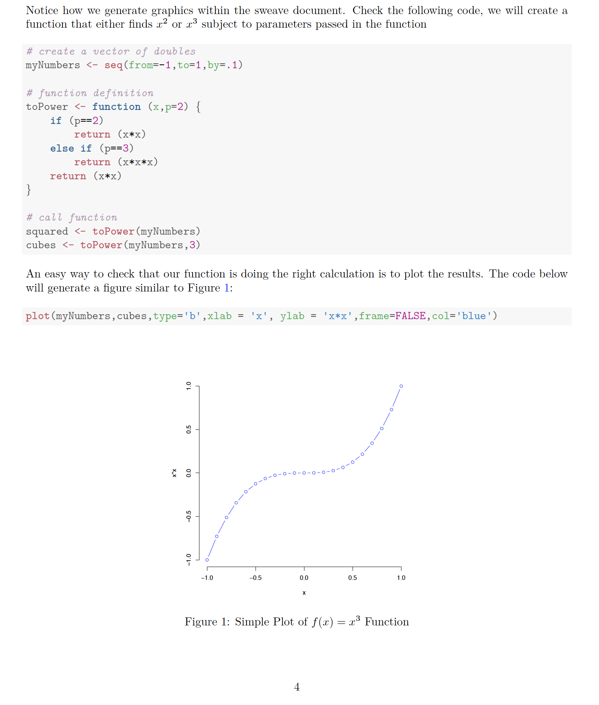

### 1. Resources for Students 

This Git repository contains several useful resources for students, written in R and Python. The repositories inside can be cloned and run locally providing you have the necessary software. This is mainly, [R](https://www.r-project.org/about.html), [RStudio](https://rstudio.com/), [Python](https://www.python.org/downloads/) and your preferred IDE, in addition to the mentioned packages/ libraries. For some tutorials/ documents you will also need [Latex](https://www.latex-project.org/get/). Brief discretion of these repositories outlined below. For more information, navigate to specific repos:

#### 1.1 Project Template

##### 1.1.1 Overview
This template was developed for RGU Computing postgraduate students. You can check the resulting [PDF](Project-Template/SourceFiles/project_template.pdf) File. This provides you a tool to generate interactive and easy to reproduce reports.

To generate the template, we use R, Knitr, and Latex to generate a reproducible document. The Rnw (or Sweave) file allow you to create a document that contains mix of content and R code. Code will be executed within your document and the output (graphic and results) will also be embedded within your document. 
The project template also connects your document to **excel sheet**, read and present contents of the sheet neatly in your document. 
The project template also show you how to make use of **bibtex** items to cite relevant literature. A typical example of the resulting document is shown in the Figure below:  
 

Another example from the project template is shown below, where you connect to an excel sheet, generate the corresponding latex text and embed it within your document. It also shows the list of Bibliographies cited in your report: 

##### 1.1.1 Customise the Template 

You can download, customise and re-run the template to suit your needs. You will need to have R, RStudio, and Latex installed. Also you need to pay attention for the followings: 

* Download the source files at [Code](Project-Template/SourceFiles/)
* Explore and study `project_template.Rnw` at [Code](Project-Template/SourceFiles/project_template.Rnw)
* Explore the xlsx files inside the Data folder (you can change these)
* Check the code used to connect to the xlsx files and generate the latex commands

#### 1.2 Class Decomposition

Functions for applying class-decompsition to datasets before performing classification tasks. A list of to do things (for the purpose of the coureswork). For more information about class decomposition check the [Readme File](classDecomp/Readme.md) and the [Code](classDecomp/) or refer to the papers below: 

* **E Elyan**, M M Gaber, A genetic algorithm approach to optimising random forests applied to class engineered data, Information Sciences, Volume 384, April 2017, Pages 220-234, ISSN 0020-0255, [https://doi.org/10.1016/j.ins.2016.08.007](https://doi.org/10.1016/j.ins.2016.08.007)

* **E Elyan,**, Gaber, M.M. A fine-grained Random Forests using class decomposition: an application to medical diagnosis. Neural Comput & Applic 27, 2279–2288 (2016). [https://doi.org/10.1007/s00521-015-2064-z](https://doi.org/10.1007/s00521-015-2064-z)

#### Comments / Questions 

You can reach me at [my staff page](https://www3.rgu.ac.uk/dmstaff/elyan-eyad) or on [linkedin](http://www.linkedin.com/in/elyan )

